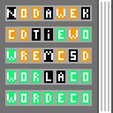

<p align="center">
    
</p>
<h1 align="center">Wordeco</h1>
<h3 align="center"><em>Wordeco is a mobile game about finding the correct word within the certain amount of tries that you are given to do so.</em></h3>

> Made by [dudushy](https://github.com/dudushy) and [Shiyinochi](https://github.com/Shiyinochi)

<details>
    <summary><h2>How we made it</h2></summary>
    
## Topics
- [Starting Project](#starting-project)

- [Generating `.apk` (Android)](#generating-apk-android)

- [Running the App (Android)](#running-the-app-android)

- [Making the App](#making-the-app)

### Starting Project

1. Download [Node.js](https://nodejs.org/en/download/).

1. Install `npm`:
    ```bash
    $ npm install -g npm
    ```

1. Install Ionic CLI:
    ```bash
    $ npm install -g @ionic/cli
    ```

1. Start Ionic Project (Tabs Template):
    ```bash
    $ ionic start Wordeco tabs --cordova

    ? Framework: Angular

    [WARN] About to integrate your app with Cordova.
    ? Are you sure you want to continue? (Y/n) y

    ? Create free Ionic account? (y/N) n
    ```

1. Install Cordova:
    ```bash
    $ npm i -g cordova
    ```

1. Install Cordova Resources:
    ```bash
    $ npm i -g cordova-res
    ```

1. Generate Cordova Resources:
    ```bash
    $ cordova-res
    ```

1. Add Android Platform:
    ```bash
    $ ionic cordova platform add android
    ```

1. Install Native Run:
    ```bash
    $ npm i -g native-run
    ```

1. Install [Android Studio](https://developer.android.com/studio#downloads) with all SDK and Platform Tools [needed](https://ionicframework.com/docs/developing/android).

1. Setup ESLint:
    ```bash
    $ npm install -g eslint
    ```

    ```bash
    $ npm init @eslint/config

    Need to install the following packages:
    @eslint/create-config
    Ok to proceed? (y) y
    ```

    - :question: How would you like to use ESLint? · `problems`

    - :question: What type of modules does your project use? · `none`

    - :question: Which framework does your project use? · `none`

    - :question: Does your project use TypeScript? · `Yes`

    - :question: Where does your code run? · `browser, node`

    - :question: What format do you want your config file to be in? · `JavaScript`

    - @typescript-eslint/eslint-plugin@latest @typescript-eslint/parser@latest
        - :question: Would you like to install them now? · `Yes`

        - :question: Which package manager do you want to use? · `npm`


---
### Generating `.apk` (Android)
- Delete `www` folder

```bash
$ ionic cordova build android --aot

? May Cordova anonymously report usage statistics to improve the tool over time? (Y/n) n
```

---
### Running the App (Android)
```bash
$ ionic cordova run android --aot --livereload
```

---
### Making the App
1. Generate Homepage:
    ```bash
    $ ionic generate page home
    ```

1. Generate Game:
    ```bash
    $ ionic generate page game
    ```
---
</details>
