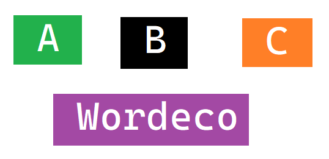

https://docs.github.com/en/get-started/writing-on-github/getting-started-with-writing-and-formatting-on-github/basic-writing-and-formatting-syntax

# The largest heading
## The second largest heading
###### The smallest heading

Text that is not a quote

> Text that is a quote

Use `git status` to list all new or modified files that haven't yet been committed.

**bold**
*italic*
**bold and _italic_**
***BOLD ITALIC adadawdadawd***
<br>
break line
<br>
~~Strikethrough~~

Some basic Git commands are:
```
git status
git add
git commit
```

This site was built using [GitHub Pages](https://pages.github.com/).

[Contribution guidelines for this project](docs/CONTRIBUTING.md)


<br>



- George Washington
- John Adams
- Thomas Jefferson

1. James Madison
1. James Monroe
1. John Quincy Adams

1. First list item
   - First nested list item
     - Second nested list item
     
100. First list item
     - First nested list item
     
100. First list item
     - First nested list item
       - Second nested list item
       
- [x] #739
- [ ] https://github.com/octo-org/octo-repo/issues/740
- [ ] Add delight to the experience when all tasks are complete :tada:

- [ ] \(Optional) Open a followup issue

@github/support What do you think about these updates?

@octocat :+1: This PR looks great - it's ready to merge! :shipit:

Here is a simple footnote[^1].

A footnote can also have multiple lines[^2].  

You can also use words, to fit your writing style more closely[^note].

[^1]: My reference.
[^2]: Every new line should be prefixed with 2 spaces.  
  This allows you to have a footnote with multiple lines.
[^note]:
    Named footnotes will still render with numbers instead of the text but allow easier identification and linking.  
    This footnote also has been made with a different syntax using 4 spaces for new lines.
    
<!-- This content will not appear in the rendered Markdown -->

Let's rename \*our-new-project\* to \*our-old-project\*.
